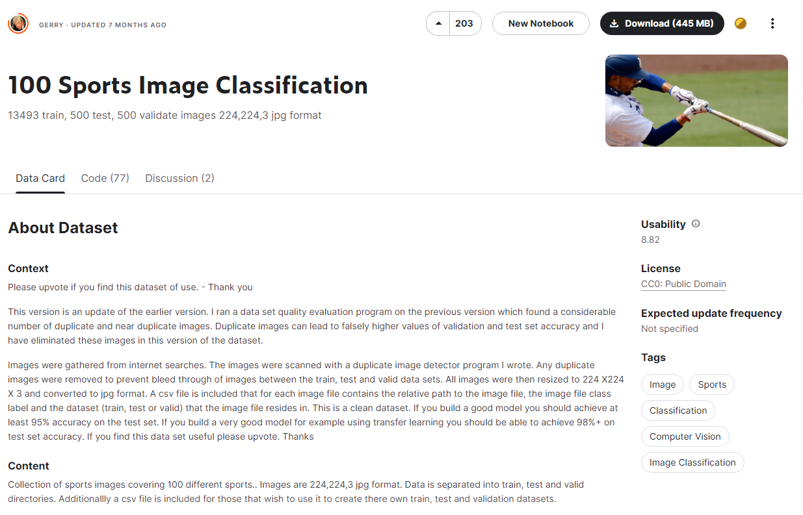
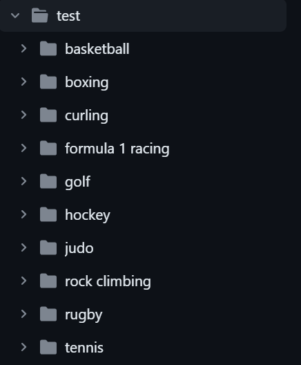

# REDES NEURONALES

Juan Carlos Acosta Perabá  
Isai Cordero García

Dataset utilizado en la práctica: [enlace](https://www.kaggle.com/datasets/utkarshsaxenadn/flower-classification-5-classes-roselilyetc)

Este dataset consta originalmente de 100 deportes diferentes pero para realizar esta práctica hemos eliminado gran parte de ellos hasta quedarnos con 10 deportes diferentes

En esta carpeta están los diferentes deportes que serán usados, las otras dos carpetas también cuentan con los mismos.
Para la carpeta train, cada deporte tiene mas de 100 imagenes diferentes para ser entrenada la red neuronal y ya con las carpetas de Test y Valid, el número se reduce significativamente a 5 imagenes por cada deporte.
