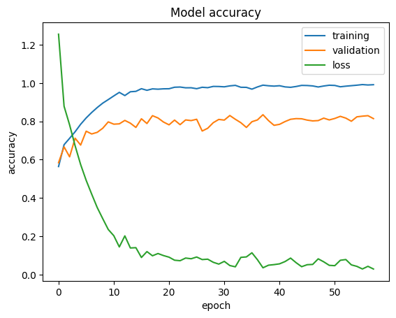

# REDES NEURONALES

Juan Carlos Acosta Perabá  
Isai Cordero García

Dataset utilizado en la práctica: [enlace](https://www.kaggle.com/datasets/utkarshsaxenadn/flower-classification-5-classes-roselilyetc)


Este dataset consta de 5 clases de flores diferentes, aunque en el título del dataset ponga 10, en las que hay apróximadamente 1000 fotos de cada clase.


En esta carpeta están los diferentes tipos de flores que se usaran para la red neuronal, todas las imagenes están en una misma carpeta y será desde el código donde diferenciaremos para los entrenamientos y la validación.

Utilizamos el método de data Augmentation para poder tener mas imágenes en el dataset.

```python
from tensorflow.keras.preprocessing.image import ImageDataGenerator, img_to_array, load_img

import glob

datagen = ImageDataGenerator(
  horizontal_flip=False,
    vertical_flip=False,
    rotation_range=25,
    zoom_range=0.20,
    shear_range=0.20,
    fill_mode="nearest")

for i in range(5):
  clases=("Daisy","Lavender","Lily","Rose","Sunflower")
  for name in glob.glob(data_dir+clases[i]+"/*.jpeg"):
    img = load_img(name)
    x = img_to_array(img)
    x = x.reshape((1,) + x.shape)
    j = 0
    for batch in datagen.flow(x, batch_size=1,
                              save_to_dir=data_dir+clases[i],
                              save_prefix="image", save_format='jpeg'):
      j += 1
      if j >= 2:
        break
print("Aumento de datos finalizado")
```

Hicimos cambios en las capas convolutivas, ajustamos los dropout y maxpooling y cambiamos la capa dense que nos indicará que tenemos las cinco clases de planta.

```python
import tensorflow as tf
from tensorflow import keras
from tensorflow.keras.layers import Conv2D, MaxPooling2D, Dropout, Dense, Rescaling, Flatten
from tensorflow.keras.callbacks import EarlyStopping

model = keras.Sequential()
model.add(Rescaling(scale=(1./127.5), offset=-1, input_shape=(150, 150, 3)))

model.add(Conv2D(128, kernel_size=(3, 3), activation='relu'))
model.add(Dropout(0.5))
model.add(MaxPooling2D(pool_size=(2, 2)))

model.add(Conv2D(128, (3, 3), activation='relu'))
model.add(Dropout(0.5))
model.add(MaxPooling2D(pool_size=(2, 2)))

model.add(Conv2D(128, (3, 3), activation='relu'))
model.add(Dropout(0.5))
model.add(MaxPooling2D(pool_size=(2, 2)))

model.add(Flatten())
model.add(Dense(256, activation='relu'))
model.add(Dropout(0.5))
model.add(Dense(5, activation='softmax'))

model.compile(loss=tf.keras.losses.categorical_crossentropy,
              optimizer=tf.keras.optimizers.Adam(1e-3),
              metrics=['accuracy'])
```

Con 58 épocas y con todos los cambios realizados podemos observar que obtenemos un porcentaje de validación del 81.42%


